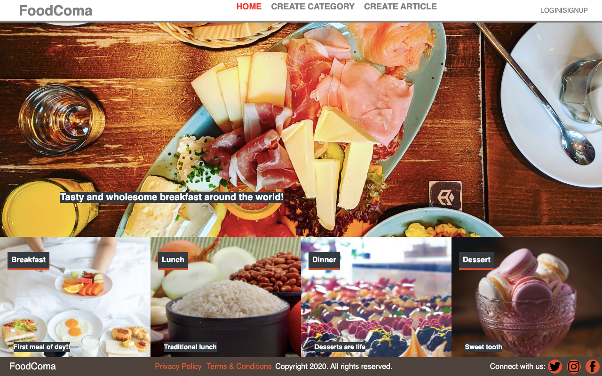

# FoodComa

> In this project I have built a food articles web application using ruby on rails.

Additional description about the project and its features.

## Built With

- Ruby -v 2.7.2
- Rails -v 6.0.3.4
- Postgresql
- VScode

## Live Demo

[Live Demo Link](https://livedemo.com)

## Getting Started

To get a local copy up and running follow these simple example steps.

### Prerequisites
To get this project up and running locally, you must already have ruby and necessary gems installed on your computer

To get this project set up on your local machine, follow these simple steps:

1. Open Terminal.
2. Navigate to your desired location to download the contents of this repository.
3. Copy and paste the following code into the Terminal: git clone https://github.com/jrai0792/food-coma
4. Run cd food-coma.
5. Run bundle install to get the necesary gems.
6. Run rails db:migrate.
7. Run rails server

## Author

👤 **Jyoti Rai**

- GitHub: [@jrai0792](https://github.com/githubhandle)

## Show your support

Give a ⭐️ if you like this project!

## 📝 License

This project is [MIT](lic.url) licensed.
